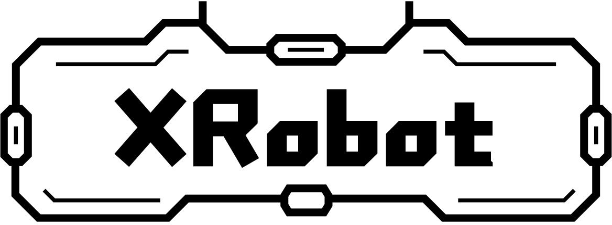
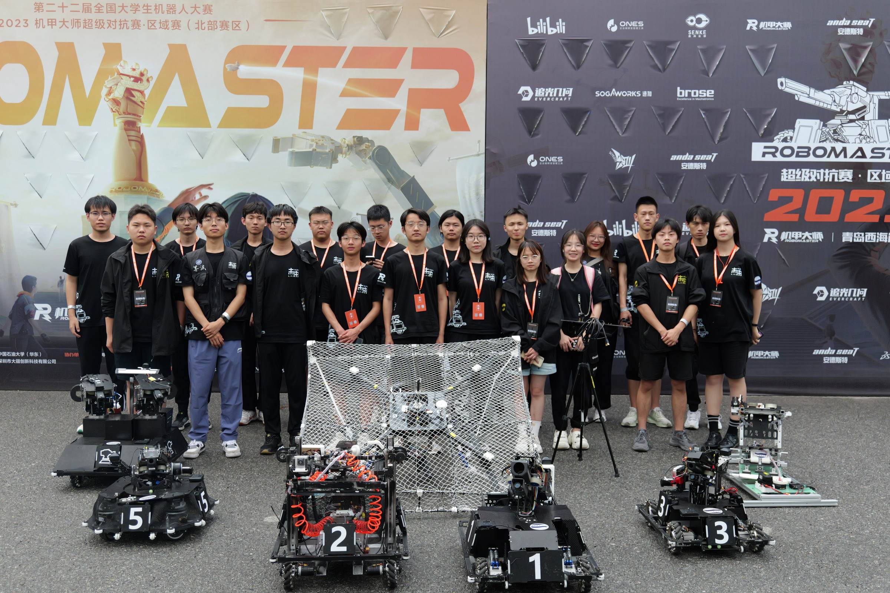

# XRobot

颠覆传统理念的嵌入式软件开发框架。诞生于Robomaster比赛，但绝不局限于此。

是时候使用现代化的方式来进行嵌入式开发了！

## Doc

请阅读我们的[文档](https://xrobot-org.github.io)，学习如何从驱动一个电机开始，搭建起完整的机器人系统。

## 引言

提起嵌入式开发，绝大多数团队或者公司都在以一种效率极其低下的方式来拼凑逻辑和功能，很难将现代的软件开发的思想融入到当中去。当然，其中不乏有优秀的项目和例子，其规范的代码风格，先进的架构和编译系统都值得深究。但他们往往都局限于某种平台或者应用，例如PX4专注于无人机系统，主要支持ROS和Nuttx。而那些主要面向MCU的框架，例如ESP-IDF、BabyOS等，自身都有较大的局限性。所以是否能有一种方式，既能实现现代化的开发，又能完美兼容裸机到RTOS再到Linux，甚至是运动学仿真呢？这就是我们的尝试——XRobot。

## 性能

### MCU

> can总线微动模块

使用STM32F103C8，通过CAN总线上报多个微动开关状态。自带命令行更改CAN ID与上报频率。SRAM占用4.35kb，Flash占用46.3kb。

> 工程机器人

使用STM32F407IG，单板实现控制底盘、抓取机构等十五个电机和三个can总线微动模块。同时接收自定义控制器/裁判系统/遥控器数据，绘制自定义UI，板载陀螺仪AHRS姿态解算，命令行和日志打印。SRAM占用30.6k，CCMRAM占用64k，flash占用197.5k。

### Linux

使用Raspberry 4B，实现8路CAN转UART模块数据接收，校验，统计与UDP转发。最高速率60000pps，ram占用1.3mb，连续一周稳定运行。

## 主要特色

* 利用现代化的构建系统(CMake & Clang & Ninja)实现跨平台高速编译
* VSCode/CLion一键编译调试与ClangTidy代码检查
* 完善的[文档](https://xrobot-org.github.io)与入门教程
* CI/CD自动构建和固件发布
* 兼容多开发板和操作系统（Linux/Webots仿真/FreeRTOS/裸机）
* 图形化/命令行参数配置
* 命令行界面（CLI）与消息订阅发布
* 部分支持Arduino

## 组成

XRobot基本部分是一套开发板与功能模块的管理系统，能够让使用者选择所需的模块并搭建成完整的机器人系统。基于模块化开发即插即用，尽可能对代码进行复用，又基于配置文件对功能细节进行定制和调整以便适应多种场景。同时统一底层与操作系统API以便标准化代码。

* hw/bsp 包含底层外设驱动的通用封装，主函数入口，开发板的调试工程和配置文件等。
* hw/mcu 不同厂家和型号MCU的通用SDK和配置脚本。
* src/system 包含不同操作系统的兼容层，提供信号量/线程管理/队列/定时器等通用接口。
* src/device 通过操作底层接口对外部设备实现通信和控制的模块。
* src/module 包含多个设备，实现特定功能的模块。
* src/component 与硬件无关的数学运算
* src/robot 将多个模块和设备组合，完成复杂机器人功能

## 软件工具

以下工具在所有框架支持的设备上，甚至包括裸机平台都提供了实现，保证系统API的统一

* 消息订阅
* 命令行
* 数据库
* 线程管理、软定时器、信号量、实时信号、互斥锁等系统API
* 队列/链表等数据结构
* 原生支持内存分配（new/malloc）和printf
* log打印

## 应用案例

> Robomaster

* 麦轮/舵轮/平衡步兵
* 英雄
* 哨兵
* 工程
* 飞镖架
* 无人机

> 成品模块

* 六轴CAN总线IMU模块
* CAN转UART模块
* BLE配网模块
* CAN总线微动检测模块
* 诸多商业产品案例

|                                                              |                                                               |                                                               |
| ------------------------------------------------------------ | ------------------------------------------------------------- | ------------------------------------------------------------- |
| `` | `` | `` |

`以上机器人均使用XRobot驱动`

## 硬件支持

| MCU         | Board                                                                                                              | Image                                                                |
| ----------- | ------------------------------------------------------------------------------------------------------------------ | -------------------------------------------------------------------- |
| STM32F407IG | [Robomaster C型开发板](https://www.robomaster.com/zh-CN/products/components/general/development-board-type-c/info) | ``            |
| STM32F302CB | [IMU-DEV-BOARD](https://xrobot-org.github.io/1.hardware/3.IMU-DEV.html)                                            | ``       |
| STM32F446RE | [C-Mini](https://xrobot-org.github.io/1.hardware/1.C-MINI.html)                                                    | ``        |
| STM32F103   | [F103 CAN](https://xrobot-org.github.io/1.hardware/4.F103_CAN.html)                                                | ``       |
| ESP32-C3    | [ESP32C3-Core](https://xrobot-org.github.io/1.hardware/2.ESP32C3-Core.html)                                        | `` |
| Linux x86   | [Intel NUC](https://www.intel.cn/content/www/cn/zh/products/details/nuc.html)                                      | ``             |
| Linux arm   | [Raspberry pi 4B](https://www.raspberrypi.com/)                                                                    | ``           |
| Linux arm   | [mCore-R818](https://mangopi.org/mcorer818)                                                                        | ``      |

## 图片展示

`VSCode与openOCD联合调试`

`Windows使用Mingw64原生开发`

`Windows11使用CLion在WSL下开发`

`XRobot作为外部控制器在Webots进行运动学仿真`

`利用命令行查看log、校准陀螺仪、监控电机运行数据和机器人参数配置`

`自定义UI框架`

## 相关依赖

订阅发布/日志相关功能由[OneMessage](https://github.com/Jiu-xiao/OneMessage.git)提供：`一个基于发布-订阅模型的跨平台消息框架，纯C语言编写，性能和灵活性极高`

命令行/文件系统相关功能由[MiniShell](https://github.com/Jiu-xiao/mini_shell.git)提供：`无需操作系统与动态内存分配的嵌入式Shell`
