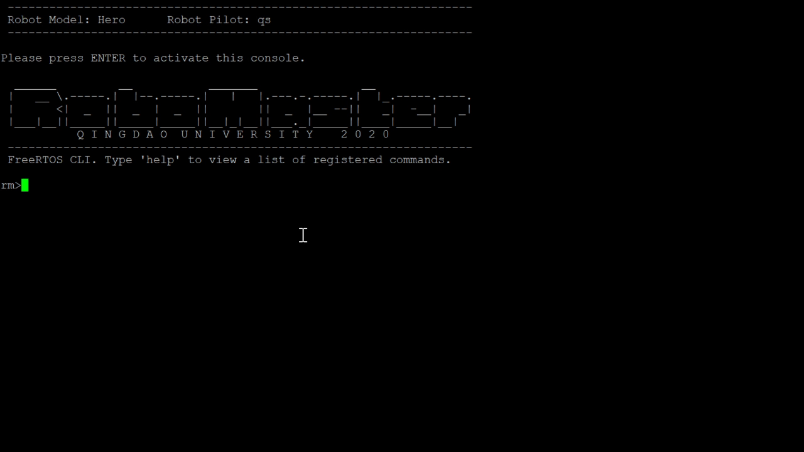
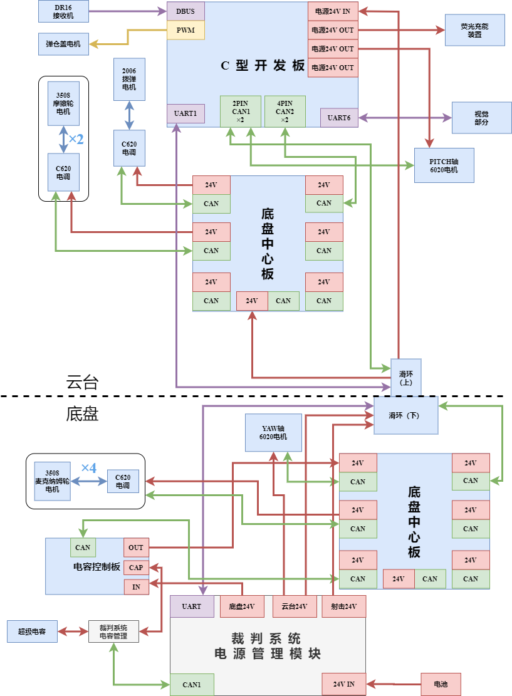
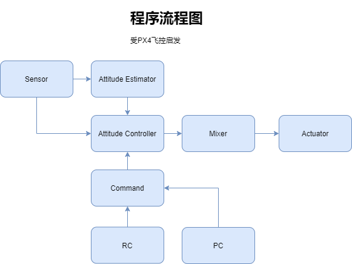
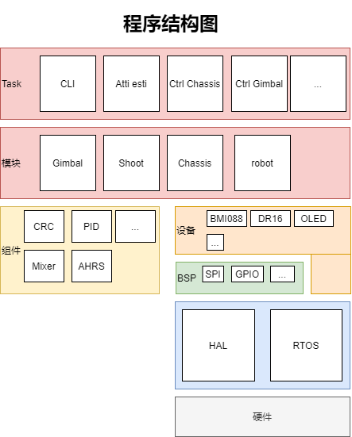
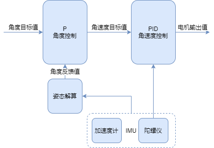

# 青岛大学 RoboMaster 嵌入式 代码开源

***UNFINISHED***

稳健开发测试中。

## 软件功能介绍

本开源软件为青岛大学未来战队机器人的嵌入式控制代码。参考了官方开源和其他战队代码，结合对其他嵌入式项目的理解（如PX4），从零编写而成。中心思想：

- 利用好RTOS和中断，释放CPU性能，保证实时性。
- 一个项目适配不同型号的机器人和不同的操作手。

这样做增加代码了的重用，减少了工作量。实现了可以通过命令行，切换所适配的机器人和操作手。代码完成后只需要烧写一次，减少维护的工作量，减少出错的可能性。

## 图片展示

### 命令行界面（CLI）

利用命令行可以辅助调试程序、校准开发板、初始化机器人、读取不同参数配置。

## 依赖&环境

- Windows平台下用CubeMX生成项目，然后用Keil uvesrion进行编辑、烧写和调试。

- TODO：利用CMake和VS Code实现跨平台开发，减少对收费软件和操作系统的依赖。

## 使用说明

- 环境安装
  - [MDK-ARM](https://www.keil.com/) （必备）
  - [STM32CubeMX](https://www.st.com/zh/development-tools/stm32cubemx.html) （可选）

- 克隆本库 `git clone --recursive https://gitee.com/qsheeeeen/qdu-rm-mcu.git`

  - 因为本软件中与视觉通信部分用的是与视觉共同维护的一个库，因此要加上`--recursive`，或在克隆完成后执行

    `git submodule init && git submodule update `

- 针对不同板子需要到不同的CubeMX工程文件（DevA.ioc、DevC.ioc）。

- （可选）利用CubeMX生成对应的外设初始化代码和Keil工程文件。

  - 每次生成代码后，请利用Git丢弃Middlewares文件夹中的所有改变。原因如下。

    1. 使用了AC6，与CubeMX默认不匹配，会影响到FreeRTOS的移植。
    2. 使用了比CubeMX更新的FreeRTOS版本，降版本会导致部分代码无法编译。

  - 因为已经生成过Keil工程文件，所以只会覆盖以前生成的代码，而不会影响手写的代码。

  - 每次生成代码后，请在HAL_InitTick函数中添加uwTickPrio = TickPriority;

- 打开MDK-ARM中的DevC.uvprojx（或DevA.uvprojx）即可进行编辑、烧写或调试。

- Keil工程中有两个Target，其中Debug用来调试，不包含编译器优化等；DevC/DevA用来编译输出最终固件。

## 文件目录结构&文件用途说明

| 文件夹 | 来源 | 内容 |
| ---- | ---- | ----  |
| Core | CubeMX | 包含核心代码，外设初始化，系统初始化等 |
| Doc | 开发者 | 文档 |
| Drivers | CubeMX | CMSIS相关库、STM32 HAL |
| Image | 开发者 | 图片 |
| MDK-ARM | CubeMX | Keil uversion 项目相关文件 |
| Middlewares | 开发者 / CubeMX | 中间件 |
| USB_DEVICE | CubeMX | USB相关文件 |
| User |  开发者 | 手动编写的代码 |
| Utils |  开发者 | 使用到的工具，如CubeMonitor, Matlab |

| User内 | 内容 |
| ---- | ----  |
| bsp | 文件夹内包含开发板信息，基于STM32 HAL对板载的外设进行控制|
| component | 包含各种组件，自成一体，相互依赖，但不依赖于其他文件夹|
| device | 独立于开发板的设备，依赖于HAL和bsp|
| module | 对机器人各模块的抽象，各模块一起组成机器人|
| task | 独立的任务，module的运行容器，也包含通信、姿态解算等 |

## 系统介绍

### 硬件系统框图

### 软件流程图

### 软件层级图

## 原理介绍

### 云台控制原理

### 其他参考文献

- 软件架构参考[PX4 Architectural Overview](https://dev.px4.io/master/en/concept/architecture.html)

- 云台控制参考[PX4 Controller Diagrams](https://dev.px4.io/master/en/flight_stack/controller_diagrams.html)

- 底盘Mixer和CAN的Control Group参考[PX4 Mixing and Actuators](https://dev.px4.io/master/en/concept/mixing.html)

## TODO

- 添加 logging.
- 给BSP想个更好的名字，备选"mcu"。
- 给BSP USB print加保护，允许不同进程的使用。
  - 给所有BSP加保护
  - device.c里面加上一个Device_Init()，在里面初始化所有mutex
- CAN设备代码优化。消息解析发送方向。
  - CAN设备动态初始化，保存好几组配置。

## Roadmap

1. 在步兵上完成所有功能。

1. 移植到所有机器人上。

