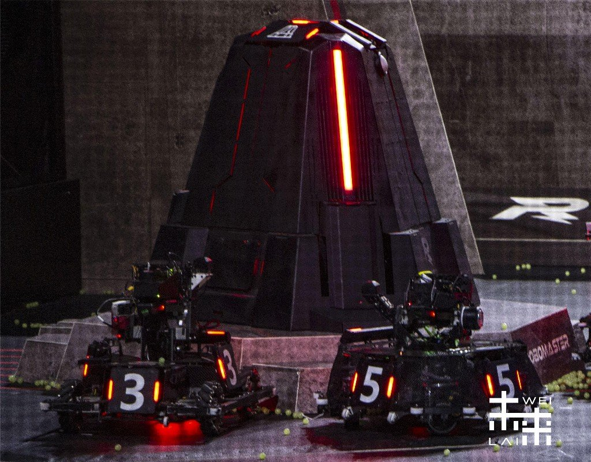
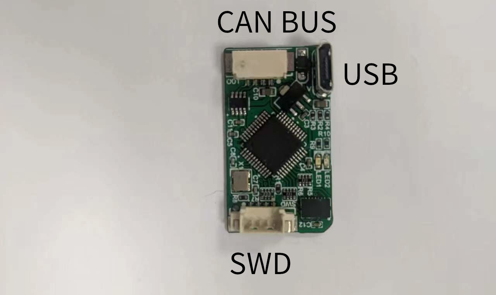
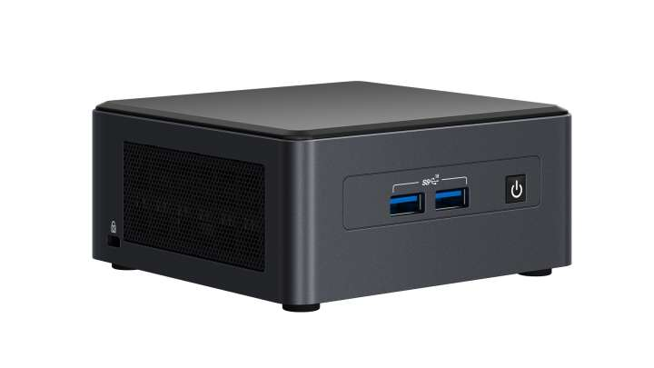

# XRobot

颠覆传统理念的嵌入式软件开发框架。诞生于Robomaster比赛，但绝不局限于此。
|                                                            |                                                             |                                                             |
| ---------------------------------------------------------- | ----------------------------------------------------------- | ----------------------------------------------------------- |
|  |  |  |

`以上机器人均使用XRobot驱动`

## 主要特色

* 利用CMake & Clang实现跨平台开发
* VSCode一键编译调试
* ClangTidy代码检查
* 完善的[文档](https://xrobot-org.github.io)
* CI/CD自动构建和固件发布
* 兼容多开发板和操作系统（Linux/Webots仿真/FreeRTOS/裸机）
* 图形化/命令行参数配置
* 命令行界面（CLI）
* 部分开发板支持Arduino开发

## 组成

XRobot基本部分是一套开发板与功能模块的管理系统，能够让使用者选择所需的模块并搭建成完整的机器人系统。基于模块化开发即插即用，又易于对功能细节进行定制和调整以便适应多种场景，底层API封装完善简洁保证良好的运行效率。

* hw/bsp 包含底层外设驱动的通用封装，主函数入口，开发板的调试工程和配置文件等。
* hw/mcu 不同厂家和型号MCU的通用SDK和配置脚本。
* src/system 包含不同操作系统的兼容层，提供信号量/线程管理/队列/定时器等通用接口。
* src/device 通过操作底层接口对外部设备实现通信和控制的模块。
* src/module 包含多个设备，实现特定功能的模块。
* src/component 与硬件无关的数学运算
* src/robot 将多个模块和设备组合，完成复杂机器人功能

## 软件工具

以下工具在所有框架支持的平台上都提供了实现，保证系统API的统一

* 消息订阅
* 命令行
* 数据库
* 队列/链表等数据结构
* 定时器
* 内存分配
* log打印

## 硬件支持

| MCU         | Board                                                                                                              | Image                                                              |
| ----------- | ------------------------------------------------------------------------------------------------------------------ | ------------------------------------------------------------------ |
| STM32F407IG | [Robomaster C型开发板](https://www.robomaster.com/zh-CN/products/components/general/development-board-type-c/info) |             |
| STM32F302CB | [IMU-DEV-BOARD](https://xrobot-org.github.io/1.hardware/3.IMU-DEV.html)                                            |        |
| STM32F446RE | [C-Mini](https://xrobot-org.github.io/1.hardware/1.C-MINI.html)                                                    |         |
| STM32F103   | [F103 CAN](https://xrobot-org.github.io/1.hardware/4.F103_CAN.html)                                                |        |
| ESP32-C3    | [ESP32C3-Core](https://xrobot-org.github.io/1.hardware/2.ESP32C3-Core.html)                                        |  |
| Linux x86   | [Intel NUC](https://www.intel.cn/content/www/cn/zh/products/details/nuc.html)                                      |              |
| Linux arm   | [Raspberry pi 4B](https://www.raspberrypi.com/)                                                                    |            |
| Linux arm   | [mCore-R818](https://mangopi.org/mcorer818)                                                                        |       |

## 图片展示

利用命令行可以辅助调试程序、校准开发板、初始化机器人、读取不同参数配置。

|

## 使用和入门

请阅读我们的[文档](https://xrobot-org.github.io)
